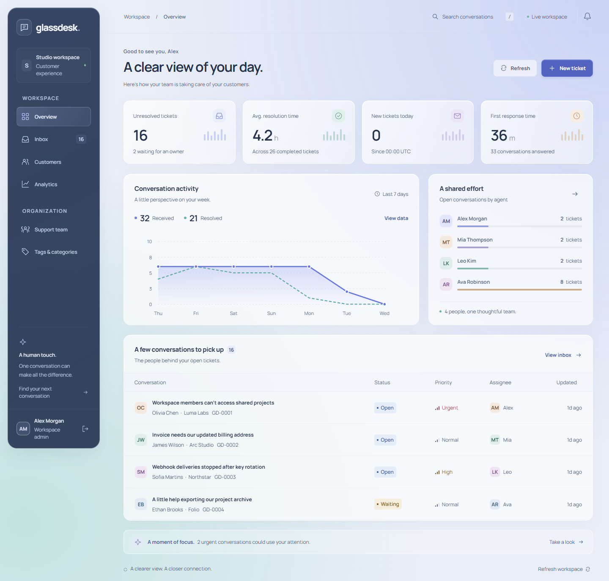

# GlassDesk design

## Direction

GlassDesk is a calm support desk with a soft translucent surface material. Its information architecture stays direct: one conversation per row, a clear owner and priority, a readable timeline, and customer context within reach. Blur sits behind the content; text itself remains opaque.

The final desktop composition uses a floating inset rail with rounded corners, a continuous lavender-to-mint canvas, softly lit work panels, and Manrope's rounded letterforms. The ticket view changes the reading rhythm into conversation plus properties. This differs from OpsBoard's edge-aligned rail, compact work tables, Plex typography, and flatter navy/teal surfaces.

## Surface and color

| Material or token | Implementation intent |
| --- | --- |
| Ink | Deep blue-gray text, rooted in `#26324b`, kept opaque over glass. |
| Action blue | `#5869d6` family for primary controls, selected states, and received-ticket data. |
| Canvas | Pale lavender and mint radial washes over a cool near-white background. |
| Panels | Translucent white fill, fine bright border, inset highlight, and low-opacity shadow. |
| Navigation | Dark slate glass, inset from the viewport with a brighter selected item. |
| Semantic color | Status labels and priority marks reinforce words rather than replacing them. |

Transparency is limited to supporting surfaces. Dense table text, timestamps, labels, and input content use readable foreground colors. CSS provides an opaque fallback for the primary glass surfaces when `backdrop-filter` is unavailable. Final contrast evidence is scoped in [QA](docs/QA.md).

## Typography and layout

Manrope is bundled locally as a variable font. Weight, line height, and restrained letter spacing differentiate page titles, compact labels, and message content without introducing a second font family. Reading sizes are adapted by breakpoint; the release review sets a 12px floor for small interface text.

The navigation rail sits inside the desktop canvas instead of touching its edges. Its rounded silhouette is echoed by panels and form dialogs. On narrower screens the sidebar condenses and the conversation properties stack below the timeline. At phone widths navigation becomes a compact horizontal structure, filters wrap, and controls use the available width. The responsive checks target 360, 768, 1440, and 1920 pixels.

## Interaction and motion

Motion for React coordinates route exit/entry with a short opacity and vertical-offset transition, normally 180ms. It keeps a recognizable spatial relationship while moving between inbox, conversation, customer, and reporting views. `MotionConfig` and `useReducedMotion` respect the operating-system preference; CSS also reduces transitions and removes movement from hover effects.

Native modal dialogs provide a focused editing surface with Escape dismissal. Filter controls stay alongside the inbox they affect. Conversation replies, internal notes, and system events have distinct treatments. Empty views explain why no work matches; mutation errors retain the editing context. Destructive dialogs identify the record being removed.

## Reporting and interpretation

The seven-day activity chart pairs two clearly labeled series with a data-table alternative. Workload bars compare current open-ticket counts by agent. Metric captions state sample sizes, units, or UTC boundaries. Decorative mini-bars in metric cards are visual accents; they do not imply additional measured trends.

The interface does not claim automated AI replies or connected email delivery. Reply text is persisted in the conversation, and the composer explains that email delivery is not connected.

## References and assets

The design is an original composition informed by the browser's backdrop-filter model and Motion's reduced-motion guidance. Research links, the selected Flaticon reference, original SVG fallback, and Manrope licensing are recorded in [CREDITS.md](CREDITS.md).
