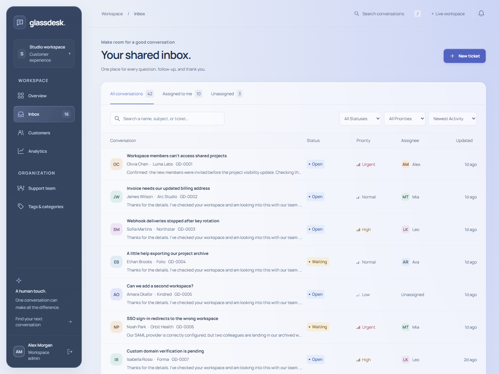
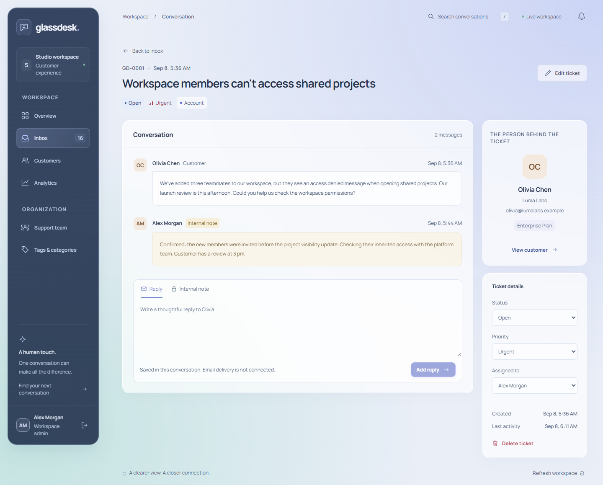
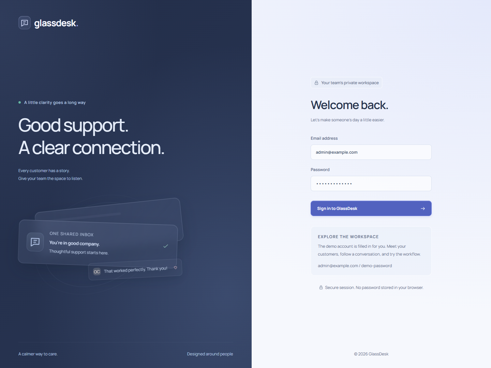
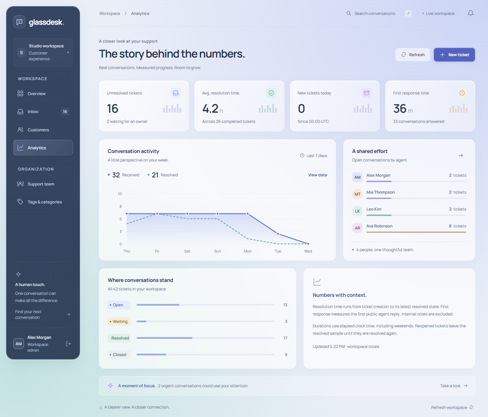

# GlassDesk

A shared support workspace that keeps the conversation, customer context, and next action together. Triage incoming questions, give each ticket an owner, keep internal notes alongside replies, and see how the team is responding.


## The workspace

- **Shared inbox:** search by subject, customer, company, or ticket number; switch between all conversations, assigned work, and unassigned tickets; filter status, priority, and agent; sort by recent activity or urgency.
- **Conversation history:** create and edit tickets, change assignments and tags, record replies and internal notes, and move work through open, waiting, resolved, and closed states. Status, priority, subject, and assignment changes appear in the timeline.
- **Customer context:** find a customer's company, plan, and past tickets. Administrators can manage customer records; customers with existing tickets are protected from deletion.
- **Support team:** administrators can create accounts, update roles, reset passwords, and deactivate agents. Active agents can work on tickets; permanent ticket deletion and customer/tag/account administration require staff access.
- **Measured reporting:** unresolved and unassigned work, tickets received today, first response and resolution averages, seven-day conversation activity, and each agent's open workload. The main chart has a daily data-table alternative.
- **Considered interactions:** translucent surfaces, an inset navigation rail, responsive ticket layouts, native form dialogs, visible focus states, reduced-motion support, and locally bundled Manrope typography.

Replies and notes are stored in the database and remain after a reload. **Outbound email is not connected**; the reply composer states this explicitly. This release is an internal agent workspace, with customer conversations entered through tickets and the demo seed.

| Inbox | Ticket conversation |
| --- | --- |
|  |  |

| Sign in | Analytics |
| --- | --- |
|  |  |

[Mobile workspace](docs/screenshots/dashboard-360.png) · [Design decisions](DESIGN.md) · [Architecture and API](docs/ARCHITECTURE.md) · [QA evidence](docs/QA.md)

## Stack

React 19, React Router, Vite, Motion for React, and custom CSS form the client. Django 5.2 and Django REST Framework provide session authentication, validation, permissions, and persistence. PostgreSQL 17 is used in Compose; SQLite is the default for native development. Gunicorn serves Django, WhiteNoise serves collected administration assets, and Nginx serves the built frontend and proxies API requests.

The backend separates models, serializers, permission policies, HTTP views, and transactional services. Ticket creation and its opening message are committed together. A row lock protects the first-response timestamp when replies arrive concurrently on PostgreSQL. The client refreshes its workspace state after successful mutations.

## Run with Docker

Requires Docker Engine and Docker Compose v2. From the repository root:

```bash
cp .env.example .env
docker compose up --build
```

On PowerShell, use `Copy-Item .env.example .env` for the first command. Choose your local database password and a random `DJANGO_SECRET_KEY` in `.env`. Open [localhost:8083](http://localhost:8083).

Container startup applies migrations, creates the shared cache table, collects static files, and runs the demonstration seed when `SEED_DEMO=true`. The PostgreSQL volume preserves data across `docker compose down` and subsequent starts. Database and API ports stay on the Compose network; the demonstration frontend binds to loopback.

## Run natively

Requires Python 3.12+ and Node.js 24 (the verified runtime). From the repository root:

```bash
python -m venv .venv
```

Activate with `source .venv/bin/activate` on macOS/Linux or `.venv\Scripts\Activate.ps1` on Windows, then:

```bash
python -m pip install -r backend/requirements.txt
python backend/manage.py migrate
python backend/manage.py seed_demo
python backend/manage.py runserver 127.0.0.1:8103
```

In a second terminal:

```bash
cd frontend
npm ci
npm run dev
```

Open [127.0.0.1:5105](http://127.0.0.1:5105). Vite proxies API requests to Django on port 8103. Native Django administration is available directly at [127.0.0.1:8103/admin/](http://127.0.0.1:8103/admin/). Use the same hostname consistently for the UI and API.

Native settings read process environment variables; copying `.env` alone configures Compose, not the native Python process. Without `DATABASE_URL`, Django creates `backend/db.sqlite3`. Development generates a private ignored `backend/.development-key` if no key is supplied.

## Demo access

The seed creates **42 tickets, nine customers, four agents, and five tags** in a new database, with example history dated relative to the seed run.

| Account | Email | Password |
| --- | --- | --- |
| Workspace administrator | `admin@example.com` | `demo-password` |
| Support agent | `mia@example.com` | `demo-password` |
| Support agent | `leo@example.com` | `demo-password` |
| Support agent | `ava@example.com` | `demo-password` |

The administrator demo is also a Django superuser. These accounts are for local evaluation. `DEMO_PASSWORD` overrides the password of newly seeded users when supplied to the seed process. Repeated seeding preserves existing records and passwords and adds missing demo records. Seeding is blocked outside debug mode unless the explicit `ALLOW_DEMO_SEED=true` override is set; deployment should leave it disabled.

## Access boundaries

| Operation | Administrator | Support agent |
| --- | --- | --- |
| View tickets, customers, tags, team, and reporting | Yes | Yes |
| Create/edit/assign tickets and change status or priority | Yes | Yes |
| Add replies and internal notes | Yes | Yes |
| Permanently delete tickets and their messages | Yes | No |
| Create/edit/delete customers and tags | Yes | No |
| Create/edit/deactivate team accounts and set passwords | Yes | No |

An active staff user or member of the `support_agents` group can enter the workspace. Administrators cannot remove their own staff access or deactivate themselves through the team API; technical superuser access is managed separately in Django administration. This is one shared support team: agent membership grants access to the shared ticket history.

Sessions use the HttpOnly `glassdesk_sessionid` cookie and the separate `glassdesk_csrftoken` CSRF cookie. These names let GlassDesk coexist with other local Django apps on the same hostname across different ports. The API helper uses the returned CSRF token; credentials are not kept in local storage. Sessions last eight hours, with Secure cookies enabled outside debug mode.

## Configuration

| Variable | Use |
| --- | --- |
| `DATABASE_URL` | Native database connection; defaults to SQLite. Compose constructs the PostgreSQL URL. |
| `POSTGRES_PASSWORD` | Compose database password. Use a unique URL-safe value. |
| `DJANGO_SECRET_KEY` | Required outside debug mode; use a new random value for each deployment. |
| `DJANGO_DEBUG` | Native default `true`; production override forces `false`. |
| `DJANGO_ALLOWED_HOSTS` | Comma-separated accepted hostnames. |
| `CSRF_TRUSTED_ORIGINS` / `CORS_ALLOWED_ORIGINS` | Exact origins including scheme and port. |
| `SEED_DEMO` | Container startup seed switch. Production override forces `false`. |
| `API_USER_RATE` | Authenticated API throttle, default `300/minute`; CI uses a higher rate for repeated browser checks. |
| `LOG_LEVEL` | Console logging level, default `INFO`. |
| `PUBLIC_HOSTNAME` | Production HTTPS hostname, used by the Compose override. |
| `TLS_CERT_FILE` / `TLS_KEY_FILE` | Existing absolute certificate-chain and private-key paths for production Nginx. |

## Deploy with HTTPS

The production override requires **Docker Compose 2.24.4+** and an existing valid TLS certificate. The configuration is provided for a dedicated host; GitHub Pages cannot run the Python service or database.

1. Create `.env` with unique database credentials and a strong `DJANGO_SECRET_KEY`. For example, generate the key using `python -c "import secrets; print(secrets.token_urlsafe(64))"`.
2. Set `DJANGO_DEBUG=false`, `SEED_DEMO=false`, `PUBLIC_HOSTNAME=support.your-domain.example`, and the absolute `TLS_CERT_FILE` and `TLS_KEY_FILE` paths. Point the hostname at the host and make TCP 443 reachable.
3. Start the production configuration:

```bash
docker compose -f compose.yaml -f compose.production.yaml up -d --build
docker compose -f compose.yaml -f compose.production.yaml exec backend python manage.py createsuperuser
```

4. Sign in over HTTPS and provision support agents from the team page. Use the same email for the first operator's username and email because workspace login authenticates by normalized email-as-username.
5. Arrange certificate renewal, database backups and restore checks, uptime/error monitoring, and ingress request limits. The production setup uses a database-backed cache so throttle state is shared by Gunicorn workers. Review proxy settings before adding any extra ingress layer.

The override exposes HTTPS on port 443, passes a fixed HTTPS scheme from Nginx to Django, disables demo seeding, and enables Django's secure-cookie/HTTPS settings. Container and TLS runtime were not exercised on the original verification machine because Docker Engine was unavailable; see [QA limitations](docs/QA.md).

## Verify

With the Python environment activated, from the root:

```bash
ruff check backend
ruff format --check backend
python backend/manage.py check
python backend/manage.py makemigrations --check --dry-run
python backend/manage.py test support
```

Frontend, from `frontend`:

```bash
npm run lint
npm run format:check
npm run build
npx playwright install chromium
npm run test:e2e
```

Browser tests need the seeded API at port 8103. Playwright starts or reuses the Vite server at port 5105. Use a dedicated demo database: the suite exercises real writes and cleans up its temporary records on success. `PLAYWRIGHT_EXECUTABLE_PATH` can select an existing Chromium binary. [QA evidence](docs/QA.md) distinguishes completed checks from configured CI and runtime limitations.

Before starting the API for the rapid browser suite, set `API_USER_RATE=3000/minute` in that terminal (`$env:API_USER_RATE='3000/minute'` in PowerShell, or `export API_USER_RATE=3000/minute` in a POSIX shell). Normal application runs keep the default `300/minute`. See QA for a separate browser-test database configuration.

GitHub Actions is configured to run backend checks against PostgreSQL, then frontend lint/format/build and Chromium flows, with screenshot and failure-trace artifacts. Repository publication metadata is in [.github/repository.json](.github/repository.json).

## Scope and next steps

This release supports a small shared team. Outbound/inbound email transport, customer self-service, file attachments, tenant isolation, real-time push updates, SLA business-hour calendars, and immutable compliance auditing are outside its scope. The UI follows API pagination but loads the complete workspace for local filtering; larger installations need server-driven views and reporting aggregation. Metric durations use elapsed clock time, including weekends, with UTC reporting boundaries.

The fictional people, companies, ticket content, and demonstration metrics illustrate the workflows and do not claim customer relationships or production operating results.

[Credits](CREDITS.md) · [MIT license](LICENSE)
